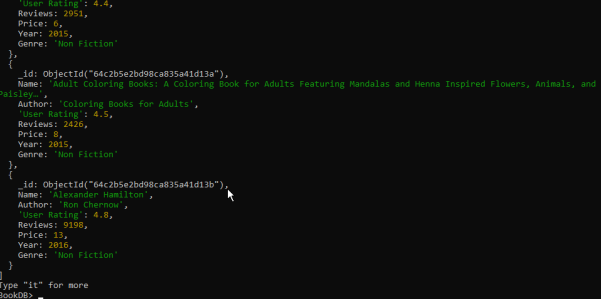
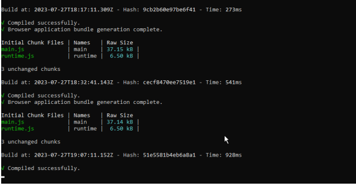
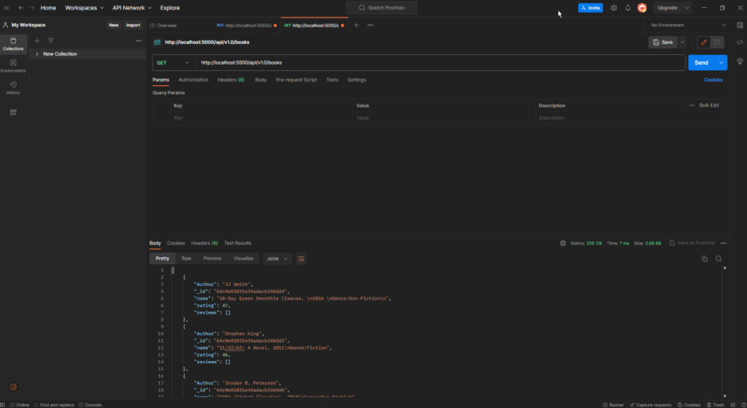
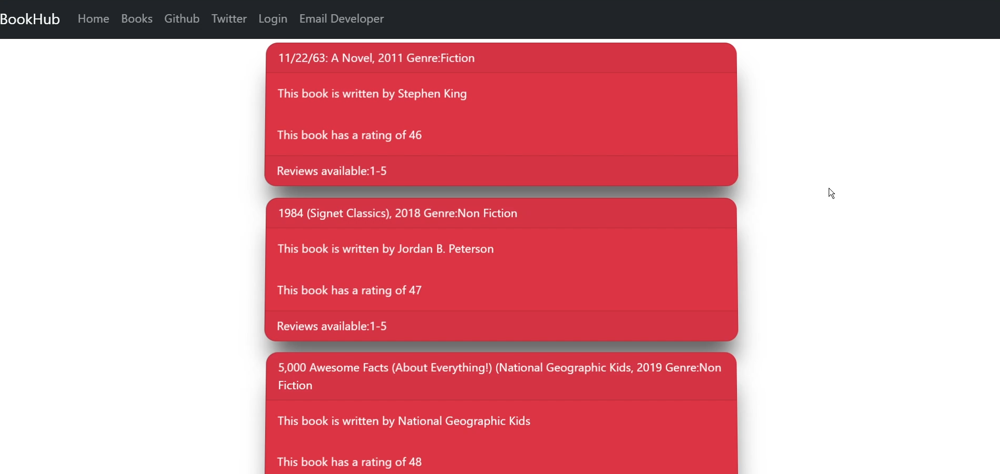
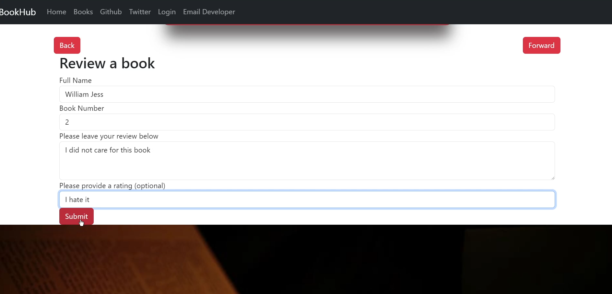

# BOOKHUB

This project was generated with [Angular CLI](https://github.com/angular/angular-cli) version 16.1.5.

## Development server

Run `ng serve` for a dev server. Navigate to `http://localhost:4200/`. The application will automatically reload if you change any of the source files.

## Code scaffolding

Run `ng generate component component-name` to generate a new component. You can also use `ng generate directive|pipe|service|class|guard|interface|enum|module`.

## Build

Run `ng build` to build the project. The build artifacts will be stored in the `dist/` directory.

## Angular server running - use ng serve
 &nbsp;     

## Stable build
 &nbsp;    

## Test requests in Postman to verify backend functionality
 &nbsp;     

## Here's what the unstyled angular output should look like
 &nbsp;     

## Review submit will store queries in mongo
 &nbsp;     

